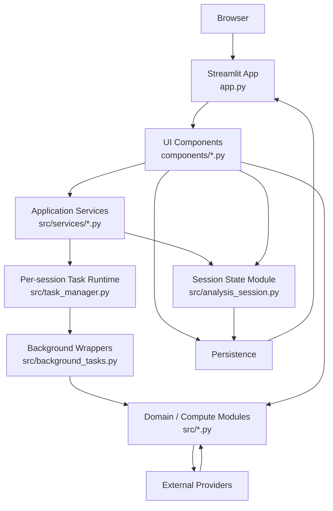
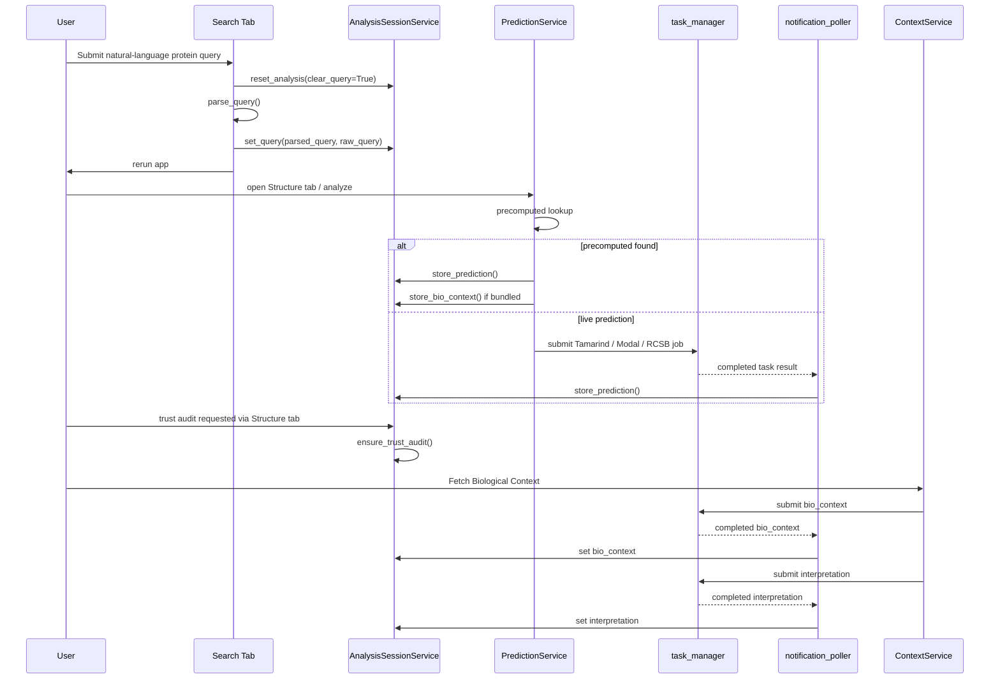
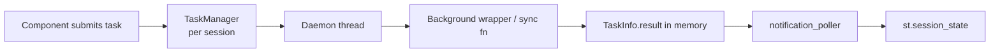

# Complete Backend Architecture Representation

Date: 2026-04-13  
Repository: `BioxYC` / `Luminous`  
Audience: Backend engineers onboarding to the current system  
Purpose: End-to-end technical representation of the current backend/runtime architecture, module ownership, state model, async execution, persistence, integrations, and operational constraints.

## 1. System In One Sentence

Luminous is a Streamlit-hosted research workbench whose "backend" runs in the same process as the UI, with a partially extracted service layer for session state, prediction dispatch, context retrieval, and project serialization, plus a per-session in-memory background-task runtime for long-running work.

## 2. Top-Level Runtime Topology



## 3. What Actually Counts As "Backend" In This Repo

There is no separately deployed API server. The backend is the combination of:

- application bootstrap and tab router in `app.py:188-520`
- service layer in `src/services/*.py`
- centralized session-state logic in `src/analysis_session.py:22-470`
- in-process async execution runtime in `src/task_manager.py:32-205`
- sync background wrappers in `src/background_tasks.py:1-260`
- domain logic modules in `src/*.py`
- local persistence in `src/user_store.py:13-106` and `data/projects/*.json`
- remote integration clients in `src/tamarind_client.py`, `src/online_tools.py`, `src/video_generator.py`, `src/bio_context.py`, `src/modal_client.py`

From a backend engineering perspective, the system boundary is the Streamlit process.

## 4. UI Surface To Backend Ownership Map

The app has eight top-level tabs in `app.py:318-359`:

- `Lumi`
  - conversational agent interface
  - primary backend modules:
    - `components/chat_followup.py:13-226`
    - `src/bio_agent.py:80-1236`
    - `src/online_tools.py:1-260`
- `Search`
  - query parsing and analysis initialization
  - primary backend modules:
    - `components/query_input.py`
    - `src/query_parser.py:10-98`
    - `src/services/analysis_session_service.py:20-76`
- `Structure`
  - structure prediction, trust audit, structural overlays, variant enrichment, Tamarind analyses
  - primary backend modules:
    - `components/structure_viewer.py`
    - `src/services/prediction_service.py:19-216`
    - `src/trust_auditor.py:25-166`
    - `src/structure_analysis.py`
    - `src/pocket_prediction.py`
    - `src/flexibility_analysis.py`
    - `src/variant_analyzer.py`
    - `src/variant_enrichment.py`
    - `components/tamarind_panel.py:36-205`
    - `components/pipeline_builder.py:188-260`
- `Biology`
  - context aggregation and interpretation
  - primary backend modules:
    - `components/context_panel.py:9-374`
    - `src/services/context_service.py:10-86`
    - `src/bio_context.py`
    - `src/bio_context_direct.py`
    - `src/interpreter.py`
    - `components/hypothesis_panel.py:14-186`
    - `src/hypothesis_engine.py:36-240`
- `Report`
  - PDF export, figures, graphical abstract, HTML export, video export
  - primary backend modules:
    - `components/report_export.py:16-260`
    - `src/pdf_report.py:1-260`
    - `components/video_panel.py:13-167`
    - `src/video_generator.py:17-147`
- `Stats`
  - standalone data-analysis subsystem
  - primary backend modules:
    - `components/statistics_tab.py:50-155`
    - `src/statistics_engine.py:1-260`
    - `src/claude_analysis.py:1-260`
- `Workspace`
  - pinned artifacts, plans, synthesis workspace
  - primary backend modules:
    - `components/playground.py`
- `Sketch`
  - image-assisted hypothesis and figure workflows
  - primary backend modules:
    - `components/sketch_hypothesis.py`

Important architectural point: all tabs render on every rerun, not only the active tab. This is explicit in `app.py:325-359`. Backend mutations in one tab become visible across all tabs on the next rerun.

## 5. Core Domain Models

The core typed backend schema is in `src/models.py:1-62`.

Primary models:

- `ProteinQuery`
  - parsed user intent
  - fields: protein, UniProt ID, mutation, interaction partner, question type, optional sequence
- `PredictionResult`
  - structure payload and confidence data
  - fields: PDB content, confidence JSON, affinity JSON, per-residue pLDDT, chain IDs, residue IDs, compute source
- `TrustAudit`
  - structure confidence interpretation
  - fields: confidence score, pTM/ipTM, region confidence, known limitations, suggested validation
- `BioContext`
  - literature, disease, pathway, and drug context
- `AnalysisSession`
  - derived typed aggregate over live session state
  - defined in `src/analysis_session.py:152-164`

These models are used at important backend boundaries, but the live runtime source of truth is still `st.session_state`, not the models themselves.

## 6. Live State Model

### 6.1 Source Of Truth

The live application state is `st.session_state`.

Bootstrap occurs in:

- `app.py:188-191`

Default keys are defined in:

- `src/analysis_session.py:22-46`

Notable keys:

- query state
  - `query_input`
  - `query_parsed`
  - `parsed_query`
  - `raw_query`
- core analysis outputs
  - `prediction_result`
  - `trust_audit`
  - `bio_context`
  - `interpretation`
- UX/runtime state
  - `active_tab`
  - `pipeline_running`
  - `_chat_thinking`
  - `_interpretation_attempted`
- workspace/report artifacts
  - `chat_messages`
  - `playground_pinned`
  - `playground_plan`
  - `generated_hypotheses`
  - `structure_analysis`
  - `generated_video`
  - `panel_figure_data`
  - `graphical_abstract_svg`
- stats subsystem
  - `stats_data`
  - `stats_results`
  - `stats_survival_data`

### 6.2 Reset Rules

Reset behavior is centralized in:

- `src/analysis_session.py:48-101`
- `src/analysis_session.py:182-206`

Reset clears:

- core analysis objects
- downstream artifacts
- many dynamic cache entries by prefix
- task manager state via `clear_tasks_safely()`

This is the current "transaction boundary" when a new query starts.

### 6.3 Dynamic Cache Model

The system uses session-state key prefixes as a cache namespace. Examples from `src/analysis_session.py:75-101`:

- `variant_data_*`
- `alphamissense_*`
- `domains_*`
- `flexibility_*`
- `pockets_*`
- `struct_analysis_*`
- `biorender_results_*`
- `pdf_bytes_*`
- `html_report_*`
- `figure_kit_*`

This is functionally a process-local cache embedded in session state.

## 7. Current Service Layer

The service layer is the main architectural improvement over the earlier baseline.

### 7.1 `AnalysisSessionService`

File:

- `src/services/analysis_session_service.py:20-76`

Responsibilities:

- default initialization
- reset orchestration
- parsed-query promotion
- prediction storage
- bio-context storage
- trust-audit creation
- session serialization and restore

Underlying implementation is in `src/analysis_session.py`.

### 7.2 `PredictionService`

File:

- `src/services/prediction_service.py:19-216`

Responsibilities:

- primary structure-prediction orchestration
- precomputed example hydration
- Tamarind dispatch
- Modal dispatch
- RCSB fallback

Main entry point:

- `PredictionService.run_prediction()`

### 7.3 `ContextService`

File:

- `src/services/context_service.py:10-86`

Responsibilities:

- submit background context retrieval
- submit background interpretation generation
- expose synchronous context and interpretation helpers

This means the service layer supports both background and inline execution modes.

### 7.4 `ProjectService`

File:

- `src/services/project_service.py:9-38`

Responsibilities:

- session serialization
- session restore
- deterministic project filename generation

This is currently a very thin wrapper over `src/analysis_session.py`.

## 8. Main End-To-End Analysis Flow



## 9. Query Intake And Initialization

Primary modules:

- `components/query_input.py`
- `src/query_parser.py`
- `src/services/analysis_session_service.py`

Flow:

1. User enters natural-language query or selects example
2. `_do_parse()` in `components/query_input.py:129-149`
3. `AnalysisSessionService.reset_analysis(st.session_state, clear_query=True)`
4. query parsing via `src.query_parser.py:31-61`
5. `AnalysisSessionService.set_query()`
6. app rerun

Query parsing behavior:

- Claude-based parse if `ANTHROPIC_API_KEY` exists
- regex/heuristic fallback if not
- produces `ProteinQuery`

Question type drives downstream behavior:

- `structure`
- `mutation_impact`
- `druggability`
- `binding`

These question types influence:

- prediction messaging
- context copy
- Tamarind tool recommendations
- hypothesis generation framing

## 10. Structure Prediction Subsystem

### 10.1 Active Path

Entry point:

- `components/structure_viewer.py:315-341`

Service:

- `src/services/prediction_service.py:21-81`

Dispatch order:

1. precomputed payloads
2. Tamarind live prediction
3. Modal live prediction
4. RCSB experimental structure fallback

### 10.2 Precomputed Mode

Handled by:

- `src/services/prediction_service.py:150-216`

Hydrates:

- `prediction_result`
- optional `bio_context`
- variant cache
- structure analysis cache
- flexibility cache
- pocket cache
- interpretation text

This gives the app a demo/offline path and reduces latency for known examples.

### 10.3 Live Prediction Providers

Background wrappers:

- Tamarind: `src/background_tasks.py:28-63`
- Modal: `src/background_tasks.py:65-87`
- RCSB: `src/background_tasks.py:90-138`

Tamarind client:

- `src/tamarind_client.py:118-242`

Characteristics:

- shared `httpx.AsyncClient`
- polling backoff for job completion
- generic multi-tool API client, not just Boltz-2

### 10.4 Legacy Prediction Paths

Still present in:

- `components/structure_viewer.py:344-392`
- `components/structure_viewer.py:411-477`

These include:

- `_submit_prediction_background()`
- `_run_tamarind()`
- `_run_modal()`

These are architectural leftovers. They matter because engineers can still modify or call old execution paths accidentally.

## 11. Trust Audit Subsystem

Primary modules:

- `src/trust_auditor.py:25-166`
- `src/analysis_session.py:305-324`

Purpose:

- convert raw model confidence into backend-level interpretability metadata

Inputs:

- `ProteinQuery`
- PDB content
- confidence JSON
- residue metadata
- `is_experimental` flag

Outputs:

- overall confidence level
- numeric confidence score
- pTM/ipTM/complex pLDDT
- region-level confidence segments
- known limitations
- suggested validation experiments

Important behavior:

- experimental structures do not reuse B-factors as pLDDT
- mutation-specific and interaction-specific caveats are injected

This is a domain-specific backend layer on top of raw structure prediction.

## 12. Biological Context And Interpretation Subsystem

Primary modules:

- `components/context_panel.py:9-374`
- `src/services/context_service.py:10-86`
- `src/bio_context.py`
- `src/bio_context_direct.py`
- `src/interpreter.py`

Flow:

1. user triggers context fetch
2. `ContextService.submit_background_context()` submits `bio_context` task
3. background wrapper returns `BioContext`
4. poller stores context in session state
5. if trust audit exists and interpretation not attempted, interpretation task is submitted
6. interpretation text is stored and rendered

Background wrappers:

- `fetch_bio_context_background()` in `src/background_tasks.py:144-183`
- `generate_interpretation_background()` in `src/background_tasks.py:186-233`

Provider strategy:

- try MCP-backed biological context first
- fallback to direct BioMCP/API strategy
- interpretation uses Anthropic-backed synthesis with fallback behavior

The context panel also writes outputs into other subsystems, for example stats input in `components/context_panel.py:250-265`.

## 13. Conversational Agent Subsystem

Primary modules:

- `components/chat_followup.py:13-226`
- `src/bio_agent.py:80-1236`
- `src/online_tools.py:1-260`

### 13.1 Runtime Model

Chat responses are executed as background tasks:

- submit: `components/chat_followup.py:41-52`
- task ID: `chat_response`
- result promotion: `components/notification_poller.py:148-179`

### 13.2 Agent Context

The chat subsystem builds a `session_context` dict containing:

- parsed query
- protein name
- mutation and mutation position
- PDB content
- trust audit
- bio context
- confidence JSON
- variant data

See:

- `components/chat_followup.py:70-88`
- `components/chat_followup.py:142-160`

### 13.3 Tooling Model

`src/bio_agent.py` exposes a large Claude tool catalog:

- local structure analysis tools
- trust audit and bio context tools
- variant and pocket tools
- UniProt / AlphaFold / ESMFold / PDB / gnomAD / STRING / InterPro / PubChem / PharmGKB / literature tools
- BioRender search and prompt tools
- auto-investigation tools

Relevant code:

- tool schema creation: `src/bio_agent.py:80-606`
- tool execution router: `src/bio_agent.py:609-920`
- agent loop: `src/bio_agent.py:1156-1236`

### 13.4 External Online Tool Layer

`src/online_tools.py` is the synchronous provider aggregation module for the agent.

Characteristics:

- shared sync `httpx` client
- JSON-serializable outputs
- local error capture into return payloads
- broad external API surface

This is effectively an integration adapter layer for the agent subsystem.

## 14. Variant And Enrichment Subsystem

Primary module:

- `components/variant_landscape.py:21-187`

Behavior:

- auto-fetch variant landscape in background on first structure render
- data source: `src.variant_analyzer.fetch_variant_landscape`
- optional enrichment pass through `src.variant_enrichment.enrich_variants`
- enrichment runs as a second background task keyed by protein

Task IDs:

- `variant_landscape`
- `variant_enrichment_<protein>`

Storage:

- `variant_data_<protein>`
- `variant_enrichment_<protein>`

This subsystem is important because its outputs feed:

- structure overlays
- chat context
- hypothesis generation
- report content

## 15. Hypothesis Generation Subsystem

Primary modules:

- `components/hypothesis_panel.py:14-186`
- `src/hypothesis_engine.py:36-240`

Runtime:

- background task `hypothesis_generation`
- payload combines:
  - query
  - trust audit
  - bio context
  - variant landscape

Generation mode:

- Claude extended-thinking if API key exists
- standard Claude fallback
- deterministic template fallback if not

Result storage:

- `generated_hypotheses`

This subsystem is one of the app's main synthesis layers rather than a raw data fetcher.

## 16. Tamarind Multi-Tool Analysis Subsystem

There are two related but distinct Tamarind surfaces:

### 16.1 Computational Suite Panel

Primary module:

- `components/tamarind_panel.py:36-205`

Behavior:

- presents question-type-specific tools
- user selects tools
- tools run concurrently via async Tamarind orchestration
- results rendered inline and cached in session state

### 16.2 Pipeline Builder

Primary modules:

- `components/pipeline_builder.py:188-260`
- `src/tamarind_analyses.py:1-260`

Behavior:

- predefined workflow templates
- next-step recommendations based on question type
- multi-tool dispatch through `run_analyses()`

Execution model:

- async gather over selected Tamarind tools
- safe wrapper returns `error` or `skipped` result instead of raising

Supported analysis families in `src/tamarind_analyses.py:36-80`:

- structure
- mutation impact
- druggability
- binding
- antibody
- dynamics

This subsystem is the heaviest external compute orchestration surface in the repo.

## 17. Report, Figure, And Export Subsystem

Primary modules:

- `components/report_export.py:16-260`
- `src/pdf_report.py:1-260`
- `components/video_panel.py:13-167`
- `src/video_generator.py:17-147`

Capabilities:

- JSON export
- CSV export
- Markdown export
- PDF report generation
- code-generated figures
- SVG data-driven figures
- graphical abstract generation
- HTML export
- video generation

Storage model:

- outputs are cached in session state under dynamic keys such as:
  - `pdf_bytes_*`
  - `html_report_*`
  - `figure_kit_*`
  - `graphical_abstract_svg`
  - `generated_video`

Video generation path:

- submit background task `video_generation`
- worker uses Gemini Veo through `src/video_generator.py`
- result promoted by poller

PDF generation path:

- synchronous in current request/rerun path
- uses `src/pdf_report.py`
- no background job wrapper today

## 18. Statistics Subsystem

This is a partially independent backend inside the app.

Primary modules:

- `components/statistics_tab.py:50-155`
- `src/statistics_engine.py:1-260`
- `src/claude_analysis.py:1-260`

Characteristics:

- does not depend on the protein pipeline to function
- uses its own session-state namespace with `stats_` prefixes
- supports:
  - CSV/manual data entry
  - frequentist tests
  - curve fitting
  - survival analysis
  - Claude-generated analysis code

Architecture:

- UI layer in `components/statistics_tab.py`
- pure computation layer in `src/statistics_engine.py`
- Claude codegen + sandbox execution layer in `src/claude_analysis.py`

Important backend point:

- `src/statistics_engine.py` is one of the cleanest backend modules in the repo because it has no Streamlit imports.

## 19. Async Execution Model

### 19.1 Task Runtime

File:

- `src/task_manager.py:32-205`

Model:

- one `TaskManager` per Streamlit session
- task metadata held in memory
- work executed in daemon threads
- generation counter prevents stale writeback after reset

Task state:

- `PENDING`
- `RUNNING`
- `COMPLETE`
- `FAILED`

### 19.2 Completion Boundary

File:

- `components/notification_poller.py:33-218`

Runs as:

- `@st.fragment(run_every=2)`

Responsibilities:

- display active task status
- pop completed tasks
- promote results into session state
- show toasts
- trigger reruns for critical tasks

### 19.3 Known Task IDs

Observed task IDs include:

- `prediction`
- `bio_context`
- `interpretation`
- `variant_landscape`
- `variant_enrichment_*`
- `hypothesis_generation`
- `video_generation`
- `chat_response`

### 19.4 Async Architecture Diagram



This model is simple and works well for single-process operation, but it is not durable.

## 20. Persistence Model

### 20.1 User Profiles

File:

- `src/user_store.py:13-106`

Storage:

- SQLite database at `data/users.db`

Schema:

- `users(email, name, picture, created_at, last_login, preferences, saved_queries)`

Usage:

- user upsert on authenticated page load in `app.py:172-185`

### 20.2 Project Snapshots

Files:

- `components/project_manager.py:31-151`
- `src/analysis_session.py:350-470`

Storage:

- JSON files in `data/projects/*.json`

Saved payload includes:

- `parsed_query`
- `prediction_result`
- `trust_audit`
- `bio_context`
- `raw_query`
- `query_parsed`
- selected plain artifact keys
- dynamic cache entries under `_dynamic_caches`

This is effectively full-session snapshot persistence.

### 20.3 Precomputed Data

Precomputed example payloads live under:

- `data/precomputed/*`

These are loaded through `src.utils.load_precomputed()` and hydrated by `PredictionService`.

## 21. External Provider Map

### 21.1 Core Providers

- Anthropic
  - query parsing
  - biological interpretation
  - chat agent
  - hypothesis generation
  - statistics code generation
- Tamarind Bio
  - Boltz-2 prediction
  - docking
  - design
  - surface/property analyses
- Modal
  - alternative structure prediction path
- RCSB PDB
  - experimental structure fallback
- UniProt / AlphaFold DB / ESMFold / gnomAD / STRING / InterPro / PubChem / Europe PMC / Semantic Scholar
  - surfaced primarily via `src/online_tools.py`
- Gemini Veo
  - protein animation video generation
- BioMCP / MCP-backed sources
  - literature and disease/drug context
- BioRender
  - templates, icons, figure prompts

### 21.2 Provider Adapters By Module

- `src/tamarind_client.py`
- `src/modal_client.py`
- `src/online_tools.py`
- `src/video_generator.py`
- `src/bio_context.py`
- `src/bio_context_direct.py`

The adapters are useful but not yet normalized under a common resilience/telemetry policy.

## 22. Where Business Logic Lives Today

The codebase is in transition. Business logic is spread across three layers:

### 22.1 Cleanest backend/domain modules

Examples:

- `src/statistics_engine.py`
- `src/trust_auditor.py`
- `src/tamarind_client.py`
- `src/online_tools.py`
- `src/video_generator.py`

### 22.2 Transitional application-service layer

Examples:

- `src/services/*.py`
- `src/analysis_session.py`

### 22.3 Still UI-owned orchestration

Examples:

- `components/structure_viewer.py`
- `components/context_panel.py`
- `components/report_export.py`
- `components/chat_followup.py`

This matters because backend changes still often require component-level edits.

## 23. Operational Characteristics

### 23.1 Good Properties

- per-session task isolation via `_SessionProxy` in `src/task_manager.py:183-205`
- centralized reset and serialization rules in `src/analysis_session.py`
- typed domain models in `src/models.py`
- precomputed example fallback path
- clear async completion boundary in `components/notification_poller.py`

### 23.2 Current Constraints

- no durable job storage
- no separate backend service boundary
- no multi-instance-safe project persistence
- `st.session_state` is still authoritative state
- observability is minimal
- error handling is provider-specific
- legacy execution paths remain beside new services

## 24. Testing And Validation Surface

Observed validation entry point:

- `scripts/test_full_pipeline.py`

Recent branch validation reference:

```bash
./.venv/bin/python scripts/test_full_pipeline.py
```

Result:

- `79 passed, 0 failed`

Testing appears strongest at smoke/integration level. The newer service layer should make targeted unit tests more feasible than before.

## 25. Backend Risks Another Engineer Should Know Before Editing

### 25.1 Do not assume there is a backend server

If you are thinking in terms of API handlers, request middleware, worker fleets, or job tables, none of those exist yet.

### 25.2 `st.session_state` changes are production changes

Changing a session key name, reset rule, or dynamic prefix can break:

- cross-tab behavior
- project save/load
- poller result promotion
- cached overlays and report outputs

### 25.3 Task IDs are part of the runtime contract

The poller uses task IDs to decide:

- how to store results
- which toast to show
- whether to rerun

Changing a task ID without updating the poller is a backend bug.

### 25.4 Some "backend" flows still run synchronously

Not everything heavy is backgrounded. Some report generation and legacy analysis paths still run inline.

### 25.5 The service layer is real but incomplete

When adding new backend capability, prefer extending `src/services` and `src/analysis_session.py` rather than writing new orchestration directly into components.

## 26. Recommended Mental Model For New Engineers

Think about the current system in five layers:

1. `app.py` is the process entrypoint and tab router.
2. `components/*.py` are feature controllers plus UI.
3. `src/services/*.py` and `src/analysis_session.py` are the emerging application layer.
4. `src/task_manager.py` and `src/background_tasks.py` are the async runtime.
5. `src/*.py` provider/domain modules are the actual backend logic and integrations.

If you keep that model in mind, the repo becomes much easier to navigate.

## 27. Bottom Line

This backend is not an API platform; it is an embedded application backend inside a Streamlit runtime. It already does a lot: natural-language query parsing, structure prediction, trust auditing, biological context retrieval, agentic research chat, multi-tool external compute orchestration, report generation, video generation, and standalone statistics.

The architectural center of gravity today is:

- `st.session_state` for live state
- `src/analysis_session.py` for state rules
- `src/services/*.py` for the beginning of an application layer
- `src/task_manager.py` + `components/notification_poller.py` for async execution
- `src/tamarind_client.py`, `src/online_tools.py`, and related modules for remote integrations

That is the current backend system another engineer is inheriting.
