# Backend / State / Retry Walkthrough

This is the inspectable version of the architecture. It names the actual files and functions that currently own backend dispatch, session state, background execution, and retry behavior.

## Short Version

The app is a Streamlit UI whose source of truth is `st.session_state`. Long-running work is pushed into per-session background threads via `src/task_manager.py`, and only the sidebar poller in `components/notification_poller.py` is supposed to promote completed background results into `st.session_state`.

There is no global retry subsystem. Retry/backoff is mostly local to individual integrations. The main explicit retry logic is Tamarind polling in `src/tamarind_client.py`.

## Inspectable End-to-End Flow

### 1. Query entry and reset

- `components/query_input.py:128-190` owns parse-time reset and query creation.
- `_do_parse()` clears running tasks with `task_manager.clear()`, wipes downstream session state keys, parses the query, writes:
  - `parsed_query`
  - `raw_query`
  - `query_parsed`
- It then forces a full rerun with `st.rerun()`.

This is the first state boundary: a new query invalidates previous analysis state and any in-flight task results.

### 2. App-wide state bootstrap

- `app.py:188-216` initializes the baseline `st.session_state` keys.
- `app.py:236-277` defines `reset_results()`, which performs the same kind of downstream invalidation for a new analysis.
- `app.py:381-423` renders all tabs on every rerun, so tab content is effectively a projection of `st.session_state`.

### 3. Structure request dispatch

- `components/structure_viewer.py:47-52` is the lazy trigger: if `prediction_result` is missing, `render_structure_viewer()` calls `_run_prediction(query)`.
- `_run_prediction()` in `components/structure_viewer.py:321-436` owns backend selection and fallback order.

Current order when `compute_backend == "auto"`:

1. Precomputed example assets from `data/precomputed/*`
2. Tamarind background prediction
3. Modal background prediction
4. RCSB experimental structure fetch

Backend selection UI lives in `app.py:543-558`.

### 4. Background execution boundary

- `src/task_manager.py:55-223` owns task execution.
- `TaskManager.submit()` spawns a daemon thread and tracks task metadata.
- `TaskManager.clear()` invalidates in-flight tasks by incrementing a generation counter.
- `_SessionProxy` stores one `TaskManager` per browser session in `st.session_state["_task_manager"]`.

This is the main ownership split:

- UI code submits work.
- Background wrappers do network/compute work.
- The task manager holds temporary task state.
- The poller commits finished results into `st.session_state`.

### 5. Prediction backend wrappers

- `components/structure_viewer.py:439-487` submits the prediction task.
- `src/background_tasks.py:28-87` contains the sync wrappers used by background threads.

Prediction backends:

- Tamarind:
  - submit wrapper: `src/background_tasks.py:28-62`
  - transport client: `src/tamarind_client.py`
- Modal:
  - submit wrapper: `src/background_tasks.py:65-87`
  - transport client: `src/modal_client.py:30-52`
- RCSB:
  - background fetch path: `components/structure_viewer.py:598-637`
  - alternate sync wrapper exists in `src/background_tasks.py:90-138`

### 6. Promotion into app state

- `components/notification_poller.py:36-102` runs every 2 seconds as a sidebar fragment.
- `components/notification_poller.py:105-202` owns background result writeback into `st.session_state`.
- `components/notification_poller.py:205-234` special-cases prediction results and materializes a `PredictionResult`.

Important architectural rule:

- Background workers in `src/background_tasks.py` are explicitly not allowed to call `st.*`.
- The poller is the real writeback owner for completed background tasks.

### 7. Trust audit ownership

- `components/structure_viewer.py:54-74` owns trust-audit construction.
- It calls `build_trust_audit(...)` and writes `st.session_state["trust_audit"]`.

This is not backgrounded. The trust audit is computed inline during structure-tab render after `prediction_result` exists.

### 8. Biology/context flow

- `components/context_panel.py:23-56` owns the manual “Fetch Biological Context” action.
- `components/context_panel.py:408-424` submits the `bio_context` background task.
- `src/background_tasks.py:144-183` owns the actual context fetch fallback chain:
  1. `src.bio_context.fetch_bio_context_mcp`
  2. `src.bio_context_direct.fetch_bio_context_direct`
  3. empty `BioContext`

Interpretation flow:

- `components/context_panel.py:58-78` auto-submits interpretation once both `bio_context` and `trust_audit` exist.
- `src/background_tasks.py:186-233` reconstructs `TrustAudit` if needed and calls the interpreter.
- `components/notification_poller.py:126-131` writes the interpretation string back into `st.session_state`.

## Ownership Map

| Concern | Current owner | Inspect here | Notes |
|---|---|---|---|
| Query parse + invalidate old state | Search tab UI | `components/query_input.py:128-190` | New query wipes downstream state and clears tasks |
| Base session defaults | App bootstrap | `app.py:188-216` | Global in-memory state model |
| Compute backend choice | Sidebar UI state | `app.py:543-558` | Stored as `st.session_state["compute_backend"]` |
| Compute backend dispatch | Structure tab | `components/structure_viewer.py:321-487` | Chooses precomputed, Tamarind, Modal, RCSB |
| Background task lifecycle | Task manager | `src/task_manager.py:55-223` | Per-session isolation, thread execution, stale-result invalidation |
| Async-to-sync bridge | Background wrappers | `src/background_tasks.py:12-22` | Each worker thread gets/creates its own event loop |
| Tamarind transport | Tamarind client | `src/tamarind_client.py:118-232` | Submit, poll, download |
| Modal transport | Modal client | `src/modal_client.py:30-52` | Direct `modal.Function.from_name(...).remote(...)` call |
| Background result writeback | Notification poller | `components/notification_poller.py:105-234` | Central promotion point into `st.session_state` |
| Trust audit derivation | Structure tab render | `components/structure_viewer.py:54-74` | Inline, not backgrounded |
| Biology context fallback | Background wrapper | `src/background_tasks.py:144-183` | MCP first, then direct fetch |
| Project snapshot persistence | Project manager | `components/project_manager.py:146-358` | Saves/restores session snapshots as JSON |
| User profile persistence | SQLite store | `src/user_store.py` | Profile/preferences only, not full analysis state |

## Sequence Diagram

```mermaid
flowchart LR
    A[User clicks Analyze] --> B[components/query_input._do_parse]
    B --> C[Clear tasks and downstream session state]
    C --> D[Write parsed_query/raw_query/query_parsed]
    D --> E[Full rerun]

    E --> F[components/structure_viewer.render_structure_viewer]
    F -->|prediction_result missing| G[_run_prediction]

    G -->|auto + example hit| H[Load precomputed assets into session state]
    G -->|live compute| I[src.task_manager.TaskManager.submit]
    I --> J[src.background_tasks.run_prediction_tamarind or run_prediction_modal]
    J --> K[src.tamarind_client or src.modal_client]
    K --> L[Task marked COMPLETE or FAILED]

    L --> M[components.notification_poller.render_notification_poller]
    M --> N[_apply_prediction_result]
    N --> O[st.session_state.prediction_result]

    O --> P[components/structure_viewer.build_trust_audit]
    P --> Q[st.session_state.trust_audit]

    Q --> R[components/context_panel]
    R --> S[Submit bio_context background task]
    S --> T[src.background_tasks.fetch_bio_context_background]
    T --> U[notification_poller writes st.session_state.bio_context]

    U --> V[Submit interpretation background task]
    V --> W[src.background_tasks.generate_interpretation_background]
    W --> X[notification_poller writes st.session_state.interpretation]
```

## State Ownership

There are three distinct state layers in the current code.

### 1. UI/application state: `st.session_state`

Owned by:

- `app.py:188-216`
- `components/query_input.py:128-190`
- `components/notification_poller.py:105-234`
- `components/structure_viewer.py:54-74`
- `components/project_manager.py:146-358`

This is the main source of truth for:

- parsed query
- current prediction
- trust audit
- biology context
- interpretation
- cached per-protein overlays and analyses

### 2. Ephemeral task state: `TaskManager`

Owned by:

- `src/task_manager.py:55-223`

This state is intentionally separate from `st.session_state` until a task finishes. It holds:

- task status
- result
- error
- submission/completion timestamps
- generation number

### 3. Durable persisted state

Owned by:

- project snapshots: `components/project_manager.py:146-358`
- user profiles: `src/user_store.py`

Project snapshots serialize analysis state to JSON under `data/projects/`.
User profiles persist separately to SQLite and do not appear to own live analysis execution.

## Retry Ownership

### What actually retries today

The only explicit retry/backoff behavior in the main prediction path is Tamarind polling:

- `src/tamarind_client.py:145-181`

Behavior:

- polls `GET /jobs`
- if response is `>= 500`, sleeps and retries
- backoff grows `2s -> 4s -> 6s -> 8s -> 10s`
- stops when the timeout is reached

### What does not retry automatically

These fail fast:

- Tamarind submit: `src/tamarind_client.py:118-142`
- Tamarind result download: `src/tamarind_client.py:209-232`
- Modal prediction: `src/modal_client.py:30-52`
- RCSB fetch: `components/structure_viewer.py:598-637`
- Biology context fetch: `src/background_tasks.py:144-183`
- Interpretation generation: `src/background_tasks.py:186-233`

### Who owns failure handling

- `src/task_manager.py:121-135` converts exceptions into `FAILED` task state.
- `components/notification_poller.py:88-98` surfaces failures to the user and reruns the app so failure UI can appear.

That means current retry ownership is:

- integration-specific code may retry internally
- otherwise failures bubble to the task manager
- the UI exposes the failure and the user retries by resubmitting the action

There is no centralized retry policy, no circuit breaker, and no shared idempotency layer.

## Backend Ownership

### Compute backends

Selection and fallback live in:

- `app.py:543-558`
- `components/structure_viewer.py:321-487`

Actual implementations live in:

- Tamarind: `src/tamarind_client.py`
- Modal: `src/modal_client.py`
- RCSB: `components/structure_viewer.py:598-637`

### Context/data backends

Fallback order lives in:

- `src/background_tasks.py:167-183`

Order:

1. MCP-backed context
2. direct BioMCP/context fetch
3. empty `BioContext`

### Additional Tamarind analysis state

Secondary Tamarind tool outputs are integrated back into app state in:

- `components/pipeline_builder.py:708-780`

That path writes additional state such as:

- `esmfold_pdb`
- `docked_complex_pdb`
- `prodigy_binding`
- `solubility_score`
- `masif_surfaces`

So “backend ownership” is not limited to the initial prediction. The workspace/pipeline builder extends the state graph with more Tamarind-derived outputs.

## Current Code Realities / Caveats

These are worth calling out because they are directly inspectable in the current implementation.

### 1. `_prediction_raw` is declared but not actually written on background prediction completion

Prediction submission passes:

- `components/structure_viewer.py:453-464`
- `components/structure_viewer.py:473-480`

Both set:

- `target_keys={"__direct__": "_prediction_raw"}`

But the poller special-cases prediction tasks first:

- `components/notification_poller.py:114-117`

That early return means the generic `target_keys` write path at `components/notification_poller.py:189-202` is never reached for `task_id == "prediction"`.

So `_prediction_raw` is reset in several places, but background prediction completion does not currently populate it.

### 2. Tamarind and Modal job names are deterministic, not session-unique

See:

- `src/background_tasks.py:42`
- `src/background_tasks.py:77`

Both derive:

- `luminous_{protein_name}_{mutation or 'wt'}`

If the remote backend treats `jobName` as a unique key, this creates a possible cross-session collision risk for identical queries.

### 3. Trust-audit ownership is in the render path, not the backend path

If someone describes trust auditing as part of the backend job, that is not what the code does today.

Current behavior:

- prediction backends return structure/confidence payloads
- `components/notification_poller.py` materializes `PredictionResult`
- `components/structure_viewer.py:54-74` derives `trust_audit` later during rendering

### 4. Retry policy is integration-local, not platform-wide

The codebase currently has:

- local Tamarind poll retry/backoff
- task failure capture
- manual user retry

It does not have:

- automatic retry on all network failures
- retry budgets
- job deduplication
- idempotent resume for partially completed backend work

## Recommended Sound-Bite

If someone needs a one-paragraph summary to share:

> Luminous currently uses `st.session_state` as the application source of truth, with per-session background threads managed by `src/task_manager.py` for long-running work. Compute backend selection and fallback live in `components/structure_viewer.py`, while the actual Tamarind and Modal calls live in `src/tamarind_client.py` and `src/modal_client.py`. Background workers never write UI state directly; the sidebar poller in `components/notification_poller.py` is the writeback owner. Retry logic is not centralized: the main explicit backoff is Tamarind polling, while most other failures surface to the UI for manual retry.
